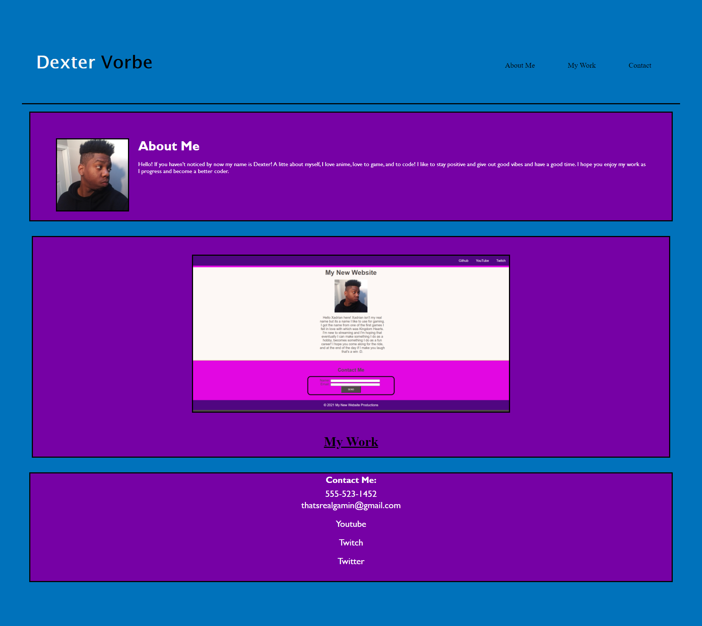
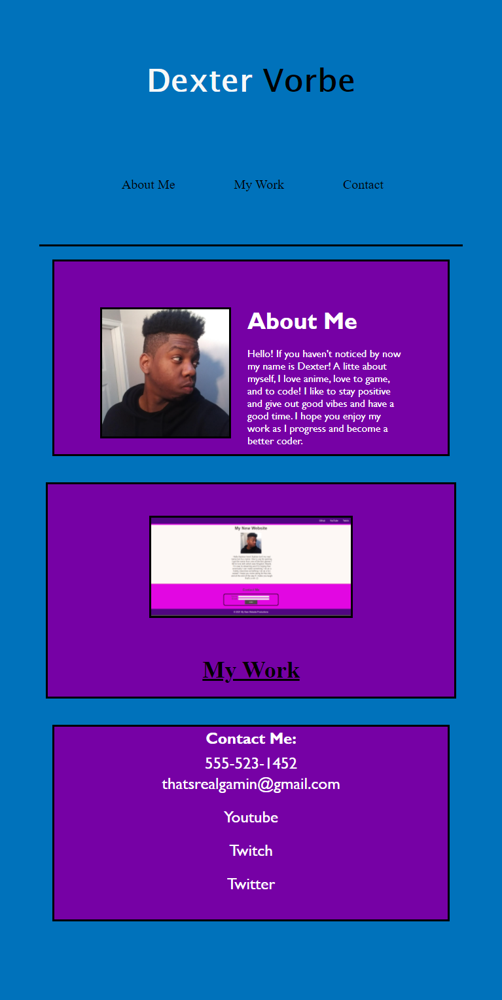

# Project-Me

```
The overall goal for this project was to create a profolio from scratch and made sure it hit a few criterias

1. When the portfolio is loaded, you will be presented with my name, a recent photo, and links to sections about me, my work, and how to contact me

2.When you click on the nav links in the navigation, the UI will scroll to the corresponding section

3. When you click on the link to the section about my work, the UI will scroll to the section with a titled image of my application

4. The layout should be responsive and adapt to other layout

5. When presented with the application, the image should be larger in size than the others

6. When you click on the image then you will be taken to the application

```

## Portfolio Screenshot


## Adapted Screenshot


# Website Link
https://dextervorbe.github.io/Project-Me/
